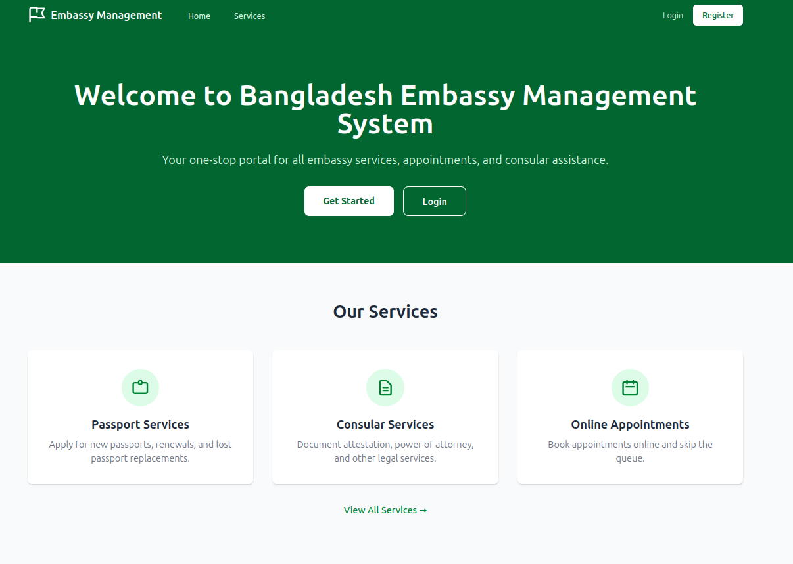
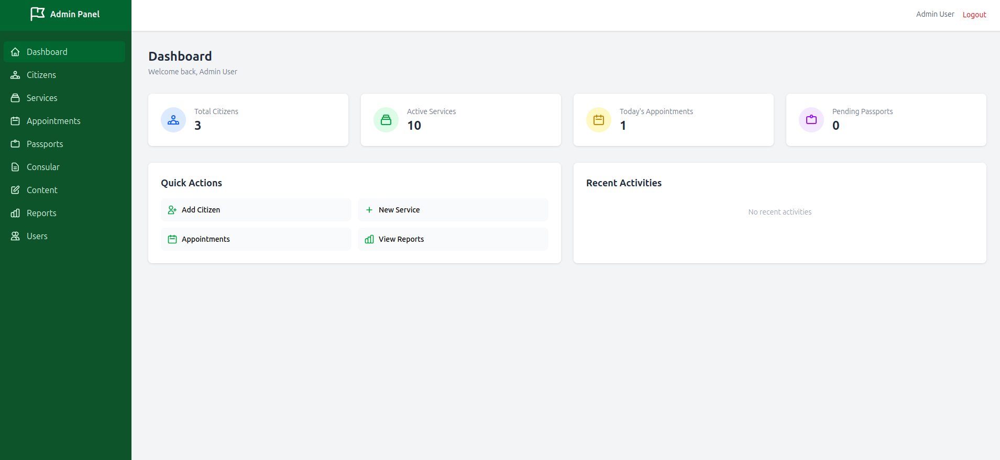
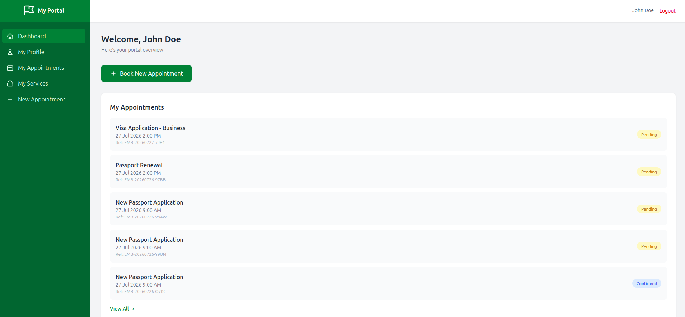
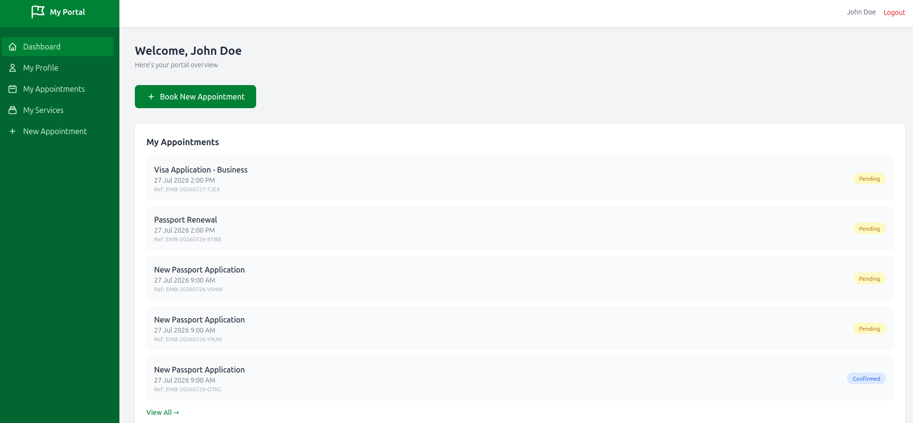
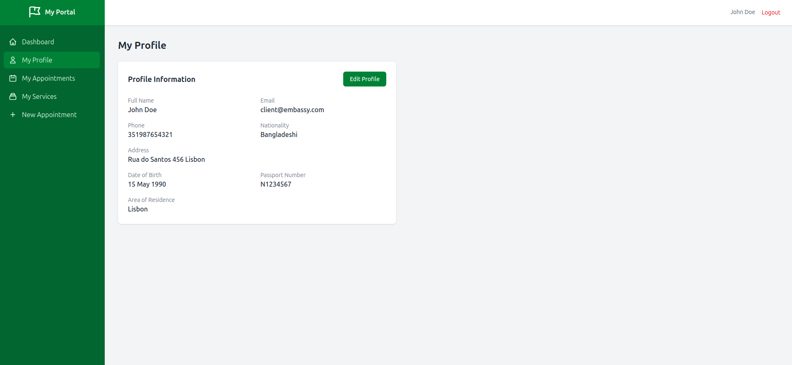
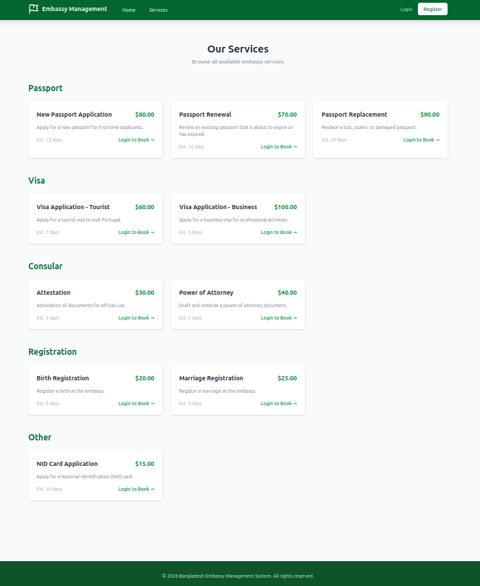
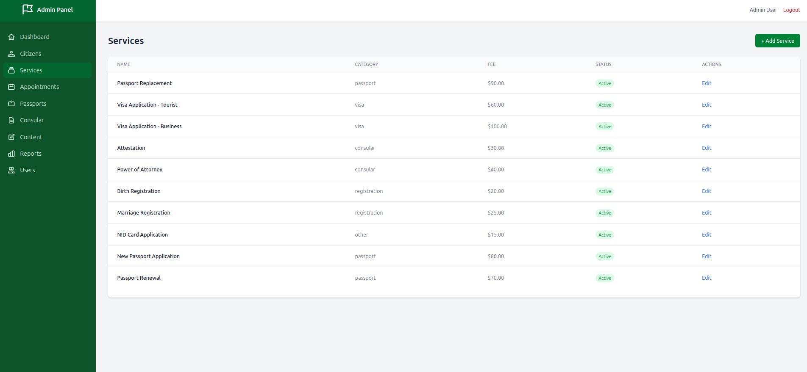
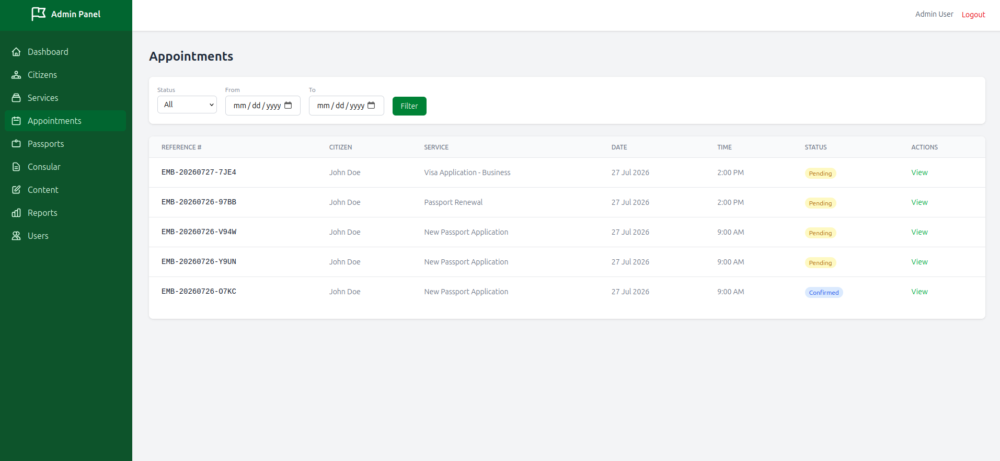
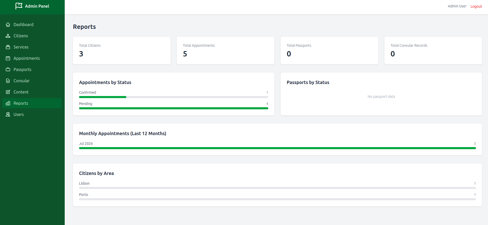

<p align="center"><a href="https://github.com/shaik-obydullah/embassy-management-system" target="_blank"></a></p>

<h1 align="center">Embassy Management System</h1>

<p align="center">
  <strong>Modernizing Consular Services with Laravel 13 &amp; Docker</strong>
</p>

<p align="center">
  <a href="https://github.com/shaik-obydullah/embassy-management-system"></a>
  <a href="https://obydullah.com/project/embassy-management-system"></a>
  <a href="https://opensource.org/licenses/MIT"></a>
  <a href="#"></a>
  <a href="#"></a>
  <a href="#"></a>
</p>

---

## About

The **Embassy Management System** is a complete rebuild of the Bangladesh Embassy in Lisbon's operational platform, originally developed in 2020 using CodeIgniter. This modernization project migrates the entire system to **Laravel 13** with a fully containerized **Docker** infrastructure.

The system serves three user roles — **Super Admin**, **Admin**, and **Client** — across citizen management, appointment booking, passport processing, consular services, content management, and reporting.

**Repository:** [github.com/shaik-obydullah/embassy-management-system](https://github.com/shaik-obydullah/embassy-management-system)  
**Project Page:** [obydullah.com/project/embassy-management-system](https://obydullah.com/project/embassy-management-system)

---

## Tech Stack

| Layer       | Technology        | Version |
| ----------- | ----------------- | ------- |
| Backend     | Laravel           | 13.x    |
| PHP Runtime | PHP-FPM           | 8.4     |
| CSS         | Tailwind CSS      | 4.0     |
| JavaScript  | Alpine.js         | 3.15    |
| Build Tool  | Vite              | 8.0     |
| Database    | MySQL             | 8.0     |
| RBAC        | Spatie Permission | 8.3     |
| PDF         | DomPDF            | 3.1     |

---

## Screenshots

### Home Page

<p align="center"></p>

### Admin Dashboard

<p align="center"></p>

### Client Portal

<p align="center"></p>

### Client Dashboard

<p align="center"></p>

### Client Profile

<p align="center"></p>

### Our Services

<p align="center"></p>

### Service Management (Admin)

<p align="center"></p>

### Register New Citizen

<p align="center"></p>

### Appointment Management

<p align="center"></p>

### Reports

<p align="center"></p>

---

## Features

### Admin Panel

- **Dashboard** — Real-time stats (citizens, services, appointments, pending passports), quick actions, activity feed
- **Citizen Management** — Searchable list, create with auto user account, detailed profile view
- **Service Management** — Full CRUD, category/fee/document management, active/inactive toggle
- **Appointment Management** — Filterable list (status, date range), status workflow (pending → confirmed → completed)
- **Passport Tracking** — 5-stage workflow (pending → processing → ready → delivered / rejected)
- **Consular Services** — Request tracking and status management
- **Content Management** — CMS pages with publish workflow and author tracking
- **User Management** — User listing, role assignment (superadmin/admin/client)
- **Reports** — Visual charts for appointments, passports, monthly trends, citizens by area

### Client Portal

- **Dashboard** — Welcome view, quick appointment booking, recent appointments
- **Profile** — View and edit citizen profile (personal info, documents, family details)
- **Appointment Booking** — 3-step wizard: Select Service → Select Time Slot → Confirm
- **Services** — Browse all active embassy services with fees and categories

### Authentication & Security

- Role-based access control (3 roles, 11 granular permissions)
- CSRF protection on all forms
- Password hashing (automatic via Laravel)
- Session-based auth with Redis backend
- Input validation on all controllers

---

## Architecture

### Docker Infrastructure (4 Containers)

```
┌─────────────────────────────────────────┐
│            embassy_network              │
│              (bridge)                   │
│                                         │
│  ┌──────────────┐  ┌─────────────────┐  │
│  │ embassy_nginx │→ │ embassy_container │
│  │   (port 8080) │  │  (PHP 8.4-FPM)  │ │
│  └──────────────┘  └───────┬─────────┘  │
│                            │            │
│                 ┌──────────┼──────────┐ │
│            ┌────▼───┐  ┌──▼────────┐    │
│            │ MySQL  │  │   Redis   │    │
│            │ (3306) │  │  (6379)   │    │
│            └────────┘  └───────────┘    │
└─────────────────────────────────────────┘
```

### Database

- **28 tables** (18 domain + 5 RBAC + 5 framework)
- **230+ columns** across all tables
- **19 Eloquent models** with relationships, accessors, and polymorphic relations

### Key Stats

| Metric          | Value                                       |
| --------------- | ------------------------------------------- |
| Blade Templates | 38 views                                    |
| Controllers     | 15 (8 admin + 4 client + 2 auth + 1 public) |
| Routes          | 39+                                         |
| Database Tables | 28                                          |
| Eloquent Models | 19                                          |
| Roles           | 3 (superadmin, admin, client)               |
| Permissions     | 11                                          |

---

## Quick Start

### Prerequisites

- Docker & Docker Compose
- Node.js 20+ (for local asset building, optional)

### Installation

```bash
# Clone the repository
git clone https://github.com/shaik-obydullah/embassy-management-system.git
cd embassy-management-system

# Start all containers
docker-compose up -d

# Install PHP dependencies
docker exec embassy_container composer install

# Install NPM dependencies and build assets
docker exec embassy_container npm install && npm run build

# Run migrations and seed database
docker exec embassy_container php artisan migrate:fresh --seed
```

### Access the Application

```
URL:      http://localhost:8080
```

### Test Accounts

| Email                  | Password | Role        |
| ---------------------- | -------- | ----------- |
| superadmin@embassy.com | password | Super Admin |
| admin@embassy.com      | password | Admin       |
| client@embassy.com     | password | Client      |
| jane@embassy.com       | password | Client      |

---

## Project Structure

```
embassy-management-docker/
├── app/
│   ├── Http/Controllers/
│   │   ├── Admin/          # 8 admin controllers
│   │   ├── Client/         # 4 client controllers
│   │   ├── Auth/           # Login + Register
│   │   └── HomeController.php
│   ├── Http/Middleware/
│   │   └── RoleMiddleware.php
│   └── Models/             # 19 Eloquent models
├── database/
│   ├── migrations/         # 21 migration files
│   └── seeders/            # 9 seeders
├── docker/
│   ├── php/Dockerfile
│   ├── nginx/default.conf
│   └── mysql/init.sql
├── resources/views/
│   ├── layouts/            # 4 layouts (app, admin, client, guest)
│   ├── admin/              # 18 admin views
│   ├── client/             # 6 client views
│   ├── auth/               # login, register
│   └── pages/              # home, services, about, contact
├── routes/web.php          # All routes
├── docker-compose.yml
└── .env.docker
```

---

## License

The Embassy Management System is open-sourced software licensed under the [MIT license](https://opensource.org/licenses/MIT).

---

<p align="center">
  <strong>Built with</strong><br>
  Laravel 13 &bull; PHP 8.4 &bull; Docker &bull; MySQL 8.0 &bull; Redis &bull; Alpine.js &bull; Tailwind CSS 4
</p>

<p align="center">
  <a href="https://github.com/shaik-obydullah/embassy-management-system">GitHub</a> &bull;
  <a href="https://obydullah.com/project/embassy-management-system">Live Demo</a> &bull;
  <a href="https://obydullah.com">Author</a>
</p>
